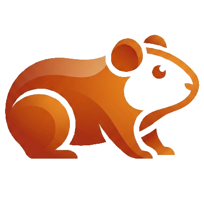

```
<div align="center">



# PhyLog

**Open-Source digitale Messwerterfassung für den naturwissenschaftlichen Unterricht**

Modular · Kostengünstig · Erweiterbar

</div>

```

---

## 💡 Motivation

> **„Nicht das bessere Messgerät entwickeln, sondern mehr Experimentieren ermöglichen.“**

Kommerzielle Messsysteme für den naturwissenschaftlichen Unterricht (z. B. von Vernier oder Leybold) bieten eine hohe Qualität, sind für viele Schulen jedoch sehr kostenintensiv. Dadurch stehen häufig nur wenige Geräte zur Verfügung und Experimente werden oftmals lediglich als Demonstrationsversuche durchgeführt.

**PhyLog** verfolgt einen anderen Ansatz: Eine offene Hard- und Softwareplattform, die für **unter 100 € pro Messplatz** aufgebaut werden kann und dadurch vollständige Klassensätze ermöglicht.

### Vorteile

- 🧪 **Eigenständiges Experimentieren** statt reiner Demonstrationsversuche
- 👥 **Arbeiten in Zweiergruppen** durch geringe Anschaffungskosten
- 📈 **Direkte Visualisierung und Auswertung** der Messdaten
- 🔓 **Open Source** – vollständig nachvollziehbar und erweiterbar
- 💰 **Bis zu Faktor 16 günstiger** als vergleichbare kommerzielle Komplettsysteme

---

## 🏗️ Systemarchitektur

PhyLog besteht aus drei modularen Komponenten, die nahtlos zusammenarbeiten.

```text
       +-------------------------------------------------+
       |                  SOFTWARE (GUI)                 |
       | Live-Diagramme | Datenexport | Geräteverwaltung |
       +------------------------+------------------------+
                                │
                         USB / Bluetooth
                                │
                                ▼
       +-------------------------------------------------+
       |                HARDWARE (ESP32)                 |
       | USB-C | Robustes Gehäuse | Sensorverwaltung     |
       +------------------------+------------------------+
                                │
                      Standardisierte Anschlüsse
                                │
                                ▼
       +-------------------------------------------------+
       |                MODULARE SENSOREN                |
       | Spannung | Strom | Temperatur | Licht | u.v.m.  |
       +-------------------------------------------------+
````

---

## ✨ Projektziele

- Entwicklung einer offenen Messplattform für Schulen
    
- Einfache Erweiterbarkeit durch modulare Sensoren
    
- Intuitive Desktop-Software zur Datenerfassung
    
- Echtzeit-Diagramme und Tabellen
    
- Export als CSV und PNG
    
- Plattformunabhängige Software
    
- Dokumentierte Hard- und Software
    

---

## 🚧 Projektstatus

> **Aktive Entwicklung**

Derzeit befinden sich sowohl die Hardware als auch die Desktop-Software in der Entwicklung.

Geplante Funktionen:

- ✅ Live-Diagramme
    
- ✅ Tabellenansicht
    
- ✅ CSV-Export
    
- ✅ Diagrammexport als PNG
    
- 🔄 Bluetooth-Unterstützung
    
- 🔄 Modulare Sensorbibliothek
    
- 🔄 Automatische Geräteerkennung
    

---

## 📄 Lizenz

Dieses Projekt wird als Open-Source-Projekt entwickelt.